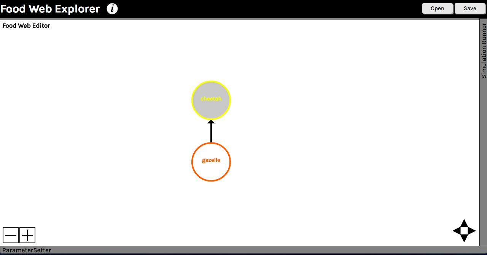
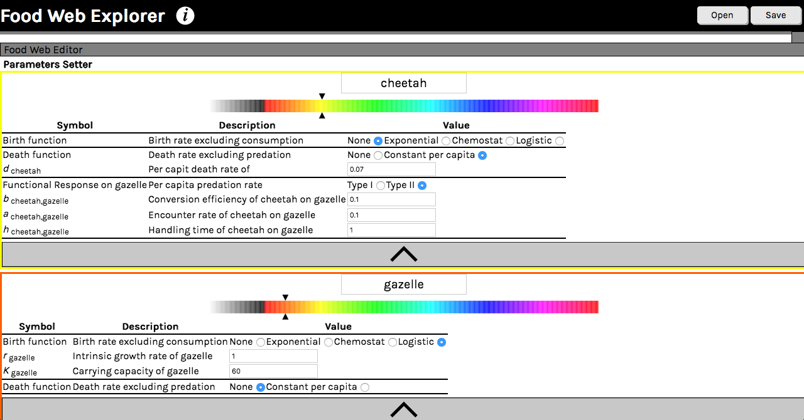
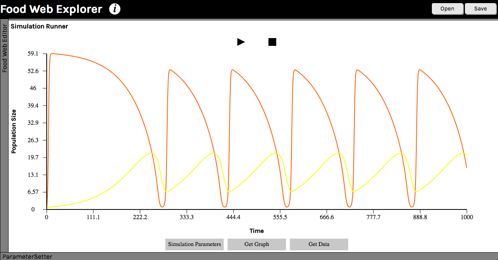
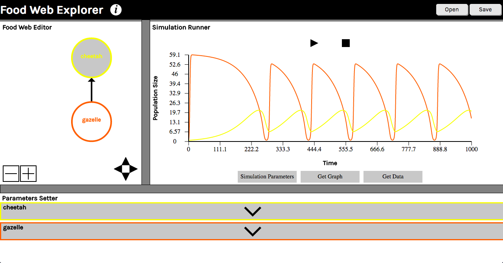

<h1>Food Web Explorer</h1>

Food web explorer translates graphical food webs into systems of differential equations.

<a href = 'https://porlan1.github.io/Food-Web-Explorer/'>https://porlan1.github.io/Food-Web-Explorer/</a>
 
 
<h3>Explore food webs using three easy steps:</h3>
<ol>
	<li>
		<a href = '#cfw'>Create Food Webs</a>
	</li>
	<li>
		<a href = '#sp'>Set Parameters</a>
	</li>
	<li>
		<a href = '#rm'>Run the Model</a>
	</li>
 
 
</ol>
<h2 id = 'cfw'>Create Food Webs</h2>
	
You can resize each of the three sections by clicking and dragging the dividers. To begin, in the "Food Web Editor", click the 'plus' button to create a population.  
			You can create as many populations as you would like.  Click and drag to move population markers.  
			To create a feeding link between two populations - first, select a consumer/predator by clicking on a population, 
			hold shift, then click on any other population to make it a resource/prey of the originally selected population.  
			If you make a mistake, you can select populations or links, and delete them with the 'minus' button.
			 
			 
			

			
			 
			 
<h2 id = 'sp'>Set Parameters</h2>

Pull up the "Parameters Setter" section. Then, click on a population in the list to open an editable table of parameters.  
Here, you can edit the population's name and color as well as functions and parameters.
  
 

 
 
<h2 id = 'rm'>Run the Model</h2>

Once you have the food web set up how you want it, you can run numerical simulations in the "Simulation Runner" section.  
			To set initial conditions for each population, click on the "Set Simulation Parameters" button.  
			Once initial conditions are set, run the model by clicking on the 'play' button above the graph.  
			If the simulation is taking too long and slowing down your computer, you can cancel a simulation 
			by clicking the 'stop' button above the graph.  In the "Simulation Runner" section you can also generate the graph and data to save.  
			Clicking on the "Get graph" or "Get data" buttons will open a new window with a graph or the data.  
			With the new window open, to save the graph, right click it and select "Save Image As...".  
			To save the data, just copy and paste it into a text file.
			  
			 
			

			
			

			 
			

			
			 
<h2>Open and save files</h2>

Food Web Explorer also gives you the option to save your food web project and come back to it later.  
			Click the "Save" button in the upper right corner.  
			This will open a new window containing the data to save.  
			Click "File" from your web browser's menu and save the file as *.json.  
			To open a file that you have previously saved, click the "Open" button in the 
			upper right corner, and select your *.json file.
			

